# Project 2: Design Journey

**For each milestone, complete only the sections that are labeled with that milestone.** Refine all sections before the final submission.

You are graded on your design process. If you later need to update your plan, **do not delete the original plan, leave it in place and append your new plan _below_ the original.** Then explain why you are changing your plan. Any time you update your plan, you're documenting your design process!

**Replace ALL _TODOs_ with your work.** (There should be no TODOs in the final submission.)

Be clear and concise in your writing. Bullets points are encouraged.

**Everything, including images, must be visible in _Markdown: Open Preview_.** If it's not visible in the Markdown preview, then we can't grade it. We also can't give you partial credit either. **Please make sure your design journey should is easy to read for the grader;** in Markdown preview the question _and_ answer should have a blank line between them.

## Understanding Users (Milestone 1)

**Make the case for your decisions using concepts from class, as well as other design principles, theories, examples, and cases from outside of class.**

You can use bullet points and lists, or full paragraphs, or a combo, whichever is appropriate. The writing should be solid draft quality but doesn't have to be fancy.

### User Interview Questions (Milestone 1)
> Plan the user interview which you'll use to identify the goals of your site's audience.
> You may use the interview template below and revise it as much as you desire.
> You are **required to author 3 of your own questions**.

**User Interview Briefing & Consent:** Hi, I am a student at Cornell University. I'm currently taking a class on web design and for a project, I am re-designing the website for Ithaca's Apple Harvest Festival. I'm trying to learn more about the people that might use this site. May I ask you a few questions? It will take about 10 minutes. You are free to quit at any time.

(These questions assume you are interviewing a festival attendee at the festival. If you didn't attend the festival, you may revise the questions and instead ask the participant to recall the last festival/event they attended. Do not ask them to speculate about visiting the Apple Harvest Festival. User speculation provides biased data.)

1. Please tell me a bit about yourself. You may omit any personal or private information.

2. What brought you to visit the Apple Harvest Festival today?

3. Before you came to the festival today, did you seek out any information about the festival before getting here?
3a. If yes, What information were you specifically looking for? Did you find it? How did you access that information?

4. When you arrived at the festival, did you seek out any information about the festival?
4a. If yes, What was that information? How did you obtain it?

5. Now that you're here participating in the festival, have you sought out information about the festival?

6. What, in the past, has been your favorite thing about the festival, and that you would want others to know to do here?
6a. Who would you say the target audience of this activity was?

7. What information were you looking about this festival, or others, that you weren't able to find, if any?
7a. Why did you need this information?

8. Now that you're at the festival, did the website seem to accurately represent the festival? Why or why not?

9.  Any other questions or comments that you didn't have the opportunity to bring up before?
...

n. What haven't I asked you today that you think would be valuable for me to know?

**After the interview:** This was really helpful. Thank you so much for agreeing to speak with me today. Have a great day!

### Interview Notes (Milestone 1)
> Interview at least 3 people from your audience. Take notes and include those notes here. Make sure to include a brief description of each interviewee.
> **Copy the interview questions above into each interviewee section below.**
> Take notes for each participant inline with the questions.

**Interviewee 1:**

Maddy Demers '25 InfoSci

- Did visit the website to check out what was going on before hand
- Found it was poorly oreinted and difficult to find information
- No enough imagery; no hours listsed
- Usually, expects event listings, food choices, carnival choices, locations, etc.
- Arrived by running, didn't need to use a map to navigate: If going up a hill, then going wrong way
- Excited for apple fest, found it much more fun than website may have alluded

**Interviewee 2:**

Carlton Cassidy '24 CS

- Had a group of friends and wanted to see Apple Fest in the commons, doesn't go much to the commons or downtown
- Visited AppleFest before, has never needed or used website for purposes of visiting
- No particular plans, just wanted to explore; never needed website for such purposes
- Favorite things were the variety of foods available - would like that to be shown on the website so others can see the selection, too.
- Didn't event know the website existed, didn't want to use it when at the festival - just prefers walking around

**Interviewee 3:**

Chukwundamebi Obi '23 Sociology

- Found it to be a typical Ithaca event. Their friend wanted to explore; has been to Apple fest many times
- Has used the website to see what the scheudle of events were for Sunday, found it helpful to find a performnace list with hours
- Once arrived, use the website for the map, but didn't find it helpful - rather just walk around and explore
- Has usually checked a website for past festivals to understand what to expect and know what event they wanted to go to
- Though the website was previously ugly, and this year's was an improvement.
- Better orginization of content, feels more cohesive, visually improved.
- Thinks the website did a good job preparing expectations.

### Goals (Milestone 1)
> Analyze your audience's goals from your notes above.
> List each goal below. There is no specific number of goals required for this, but you need enough to do the job (Hint: It's more than 1 and probably more than 2).

Goal 1: Content that prepares a user for AppleFest

- **Design Ideas and Choices** _How will you meet those goals in your design?_
  - Addition of hours to the website
  - Make list of events easy to find
  - List out vendors and oppurtunities
  -
- **Rationale & Additional Notes** _Justify your decisions; additional notes._
  - The most important aspect of a website is its content, second, its organization. Without good organization, good content is unreachable and therefore useless. Thus, it is important to include content that users desire, such as the aforementioned.

Goal 2: Good Visual Design
- **Design Ideas and Choices** _How will you meet those goals in your design?_
  - Make sure site is dynamically responsive
  - Use of photos to show essence of event
  - Use of a good palette and simple contrast
  -
- **Rationale & Additional Notes** _Justify your decisions; additional notes._
  - It is important to design a site that is accessible for all audiences, no matter their device or screen size. Thus, responsive web design is imperative. Moreover, making the site visually appealing and setting a good expectation for the user are important goals.

Goal 3: Organize Content

- **Design Ideas and Choices**
  - A menu bar that properly delegates content to different pages.
  - A home page that provides the basic information that just about every user is looking for or would find helpful
  - A gallery of photos
  - other pages with more specific information that different users will be looking for and can navigate to easily

- **Rational and Additional Notes**
- It is imperative that the content is organized in such a way that every piece of information can be easily found.

### Audience (Milestone 1)
> Briefly explain your site's audience.
> Be specific and justify why this audience is a **cohesive** group with regard to the Ithaca Apple Harvest Festival. .

Largely, the audience will be Ithacans or local college students interested in AppleFest. The audience will wish to find quick information about applefest such as events, hours, vendors, and see visual representation of the fest, such as photos and/or a map. Thus, they are cohesive geographically and have the same intentions.

## Festival/Event Website Design Exploration (Milestone 1)

Identify three festival or event websites (preferably static websites) that exist today on the web. You will be drawing inspiration from these sites for your own site; please select websites that are similar to the website you wish to create.

Include two screenshots of the home page for each site: narrow and wide.

**We'll refer to these are your "example websites."**

1. <https://www.rochesterjazz.com/>

    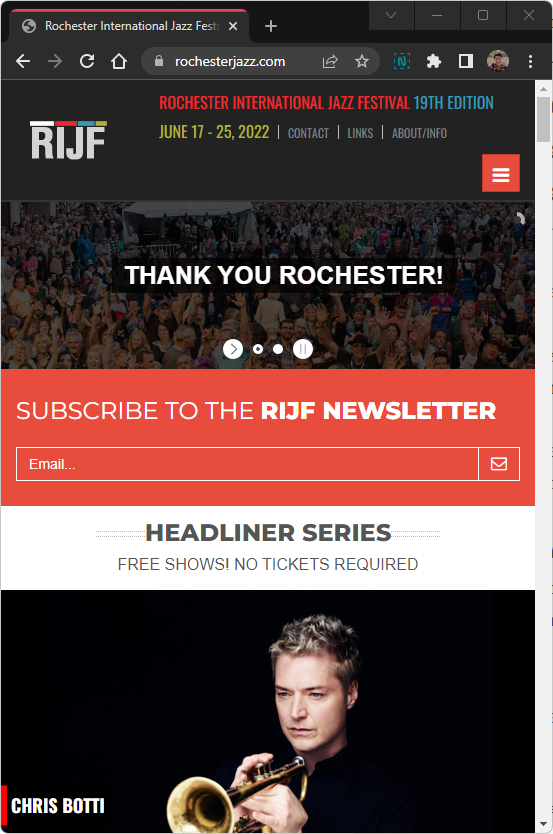

    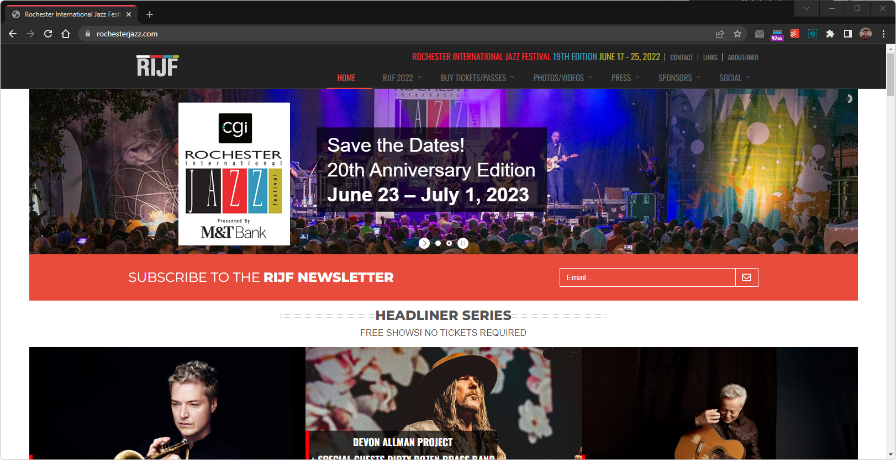)

2. <https://rochesterevents.com/lilac-festival/>

    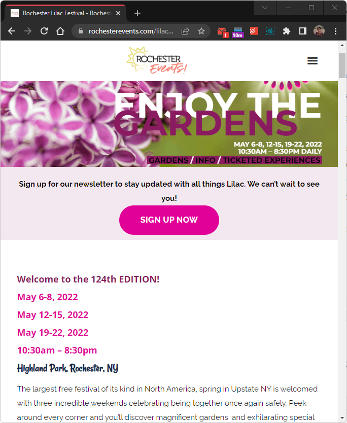
    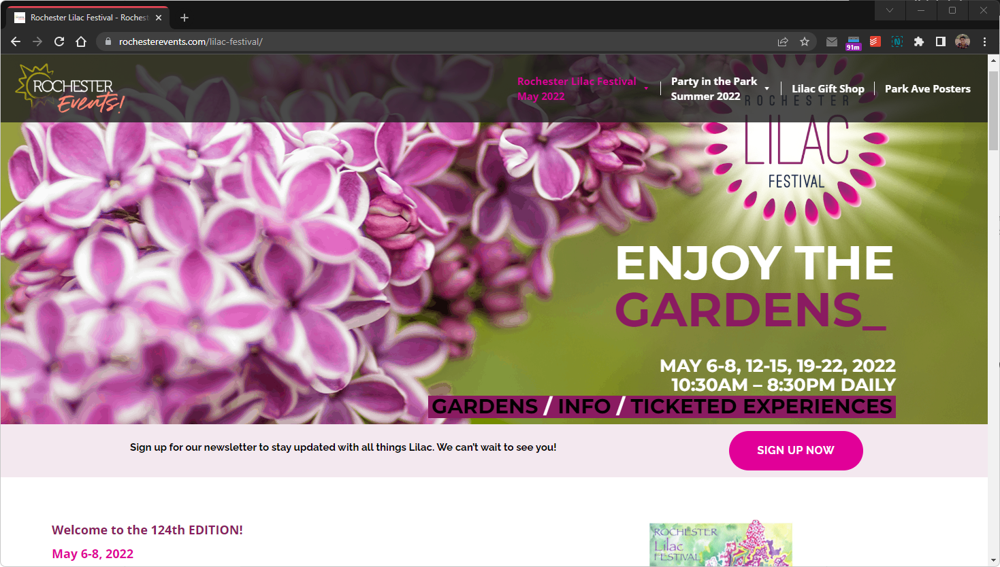

3. <https://rochesterfringe.com/>
4.
    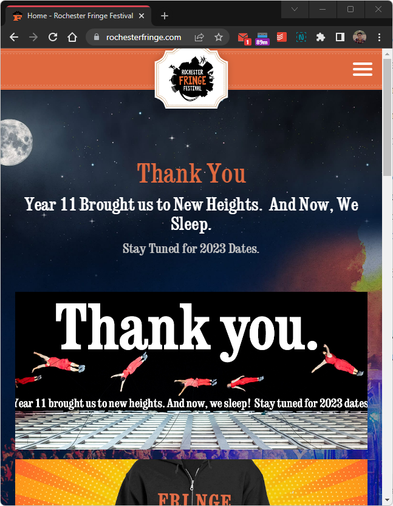
    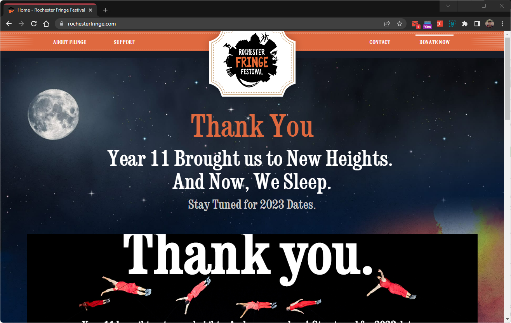

### Festival/Event Website 1 Review (Milestone 1)
> Review the website you identified above. (1 paragraph)
> In your review, include a discussion common design patterns in the site.

Consisting of primarily jazz concerts, the website emphasis the free offerings of the Rochester Jazz Festival. As such, we see headliners almost immediately, with photos, a calendar of events organized by location. The website also "features" certain highlight events, and has a blog of news & events. The design is a simple Black-White-Red palette, with the colors slightly desaturated, in theme of the Jazz Festival colors. There are also some embedded videos, as well as some statistics. The website is mobile friendly - content is still top-bottom, with some content omitted for brevity.

### Festival/Event Website 2 Review (Milestone 1)
> Review the website you identified above. (1 paragraph)
> In your review, include a discussion common design patterns in the site.

Another free festival offering coming out of Rochester, the Lilac Festival is one of the largest and most unique of its kind. In its 121st year, the festival website does well to implement a simple and navigable design. While the festival is currently out of season, there are still action items, such as learning more about past events, or signing up to volunteer. The website has not been updated, however, to reflect that these events are of the past. A user could become confused that the event listings are for the 2023 year, where they are actually of the past Festival of 2022. The mobile version preserves all content, but makes it top down. Some of it could be omitted.

### Festival/Event Website 3 Review (Milestone 1)
> Review the website you identified above. (1 paragraph)
> In your review, include a discussion common design patterns in the site.

By far the coolest festival Rochester has to offer, the Fringe Festival has been around for over a decade now. The website has been updated to show that the Fringe festival of 2022 has already happened, but to stay tuned for details about the next one. There are few options for the user: go to the gift shop, view the sponsors, or learn more. A user can learn more about past festivals to know what to expect for the 2023 festival. Like the previous websites, the meu bar turns into a hamburger when narrow.

## Content Planning (Milestone 1)

Plan your site's content.

### Your Site's Planned Content (Milestone 1)
> List **all** the content you plan to
> You should list all types of content you planned to include (i.e. text, photos, images, etc.)

- About the festival
- List of highlighted events
- Offerings (vendors, foods, performances, games)
- Sponsors
- Gallery
- Map, directions, parking
- Applications (vendors, volunteers, etc.)

### Content Justification (Milestone 1)
> Explain (about a paragraph) why this content is the right content for your site's audience and how the content addresses their goals.

This content ought to fulfill the aforementioned needs of the site audience. We plan these pieces of content and intend to organize them in these groups so they are easily discernable and will cater to the distinct needs of users. Largely, the about and highlighted events should be the most useful, and will thus be at the top. The rest of the information is helpful for perusal, or if users are looking for specifics.

## Information Architecture (Milestone 1)

### Content Organization (Milestone 1)
> Document your **iterations** of card sorting here. You must have at least 2 iterations of card sorting.
> Include photographic evidence of each iteration of card sorting **and** description of your thought process for each iteration.
> Please physically sort cards; please don't try and do this digitally.

### Final Content Organization (Milestone 1)
> Which iteration of card sorting will you use for your website?

I intend to go with the first iteration. This layout is simple to navigate, and organization should be obvious. The home page will essentially have abbreviated versions of the events and about page, whereas the events and about page will contain more for the user to explore. For example, while a map will be on the home page, a "more" button will accompany so a user may find bus routes, parking, etc. It is delegated to the other page to reduce clutter, and because not all audience users will require the information. I chose this over the second iteration as I found the second to be more confusing to navigate. For example, if I want to find a certain performance location, do I visit the directions or the events page? What is contained in "more?"

> Explain how the final organization of content is appropriate for your site's audiences.

The home page will contain all the information a user will immediately need to know about apple fest. The subsequent pages will contains more niche information that is helpful in general, and easy to find. Such organization delegates information so users can navigate the page easily and find what they need.

### Navigation (Milestone 1)
> Please list the pages you will include in your website's navigation.

- Home (index.html)
- About (about.html)
- Events (events.html)

> Explain why the names of these pages make sense for your site's audience.

They are straightforward names that indicate what they contain. About is more about the festival, events lists the events and going-ons of the festival.

## Visual Theme (Milestone 1)
> Discuss several (more than two) ideas about styling your site's theme. Explain why the theme ideas are appropriate for your target audiences. Note the theme you selected for your site and why it's appropriate for the audience and their goals.

- Some ideas for the them could a simple website with few color choices. Black and white with red accent to represent red delicious apples is one such option.
- We could also add a background of a picture of apples, which may seem cool in theory, though I doubt it will provide contrast nor good readability.
- The intent of the design is to invoke feelings of fall and prosperity, so using bright colors of red and blue would accomplish this.
- Different fonts will contribute to the style of the page. Small caps may be a friendly but bolder choice for headings. All caps would be less friendly.

## Design (Milestone 1)

The site will have a simple white background with a secondary color of blue and accent of red. This is because apples are red, and Ithaca primarily uses the color blue. The website is intended for Apple Fest, which is hosted in Ithaca, so it is important to honor both aspects with design cues. A sans-serif font will make the website friendly and modern, and elements will remain left-justified for readability.

### Layout Exploration (Milestone 1)
> Iterate on your site's design through sketching.
> Sketch both the narrow and wide versions of the site.
> Here you are just exploring your layout ideas. You don't need to sketch every page.
> Provide an explanation for each sketch explaining the idea and the design patterns you are leveraging.

.jpg) A sketch of the homepage for wide screens. The menu is at the right hand side, and the rest of the content is top-down, including an introduction, a gallery, and the map.
.jpg) A sketch the home page for wide screens. The Menu bar is under the heading, which uses the text of AppleFest rather than the logo. The content is top-down.
.jpg) Two sketches for a narrow screen. They differ in that the menu is hidden in a side-out bar and the content is top-down, with the headings centered or left-justified.
.jpg) This a sketch of wide screen homepage with two columns. It puts the welcome in the left column and events in the other, as well as gallery in one and map in the other. This layout may be best super wide screens.

### Final Design (Milestone 1)
> Include the final sketches for each of your pages.
> The sketches must include enough detail that another 1300 student could implement them.
> Provide an explanation for each sketch.

**Narrow (Mobile) Design:**

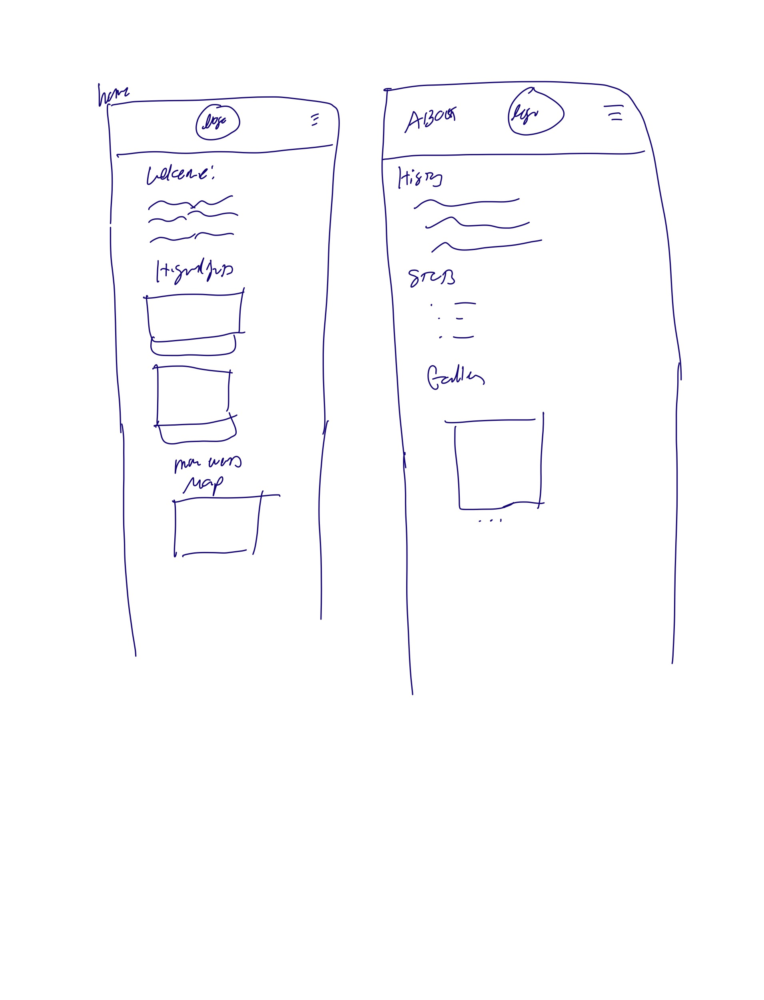 The left one is the narrow design of the home page. The logo is in the header and no text is next to it, except a hamburger for the slide out menu. The content is top-down with the headers center-justified. This may be changed to left-justification for better readability. The other page is the same in design. Items are top-down.
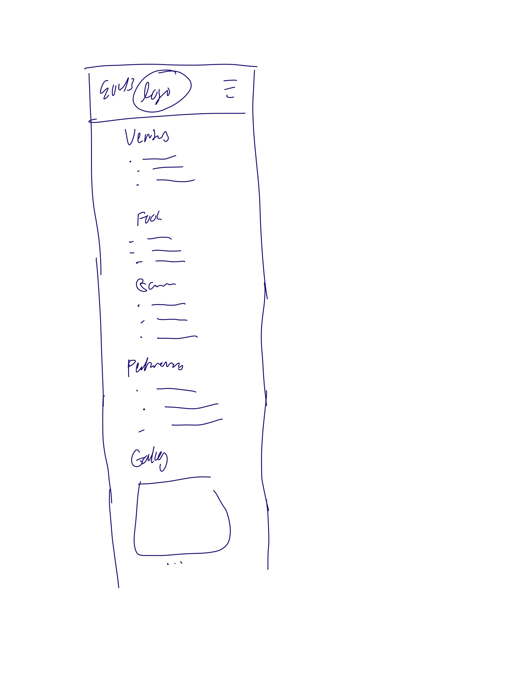 Like before, the content is top-down and a menu is hidden to the side. The content is top-down and there is no horizontal scrolling.

**Wide (Wide) Design:**
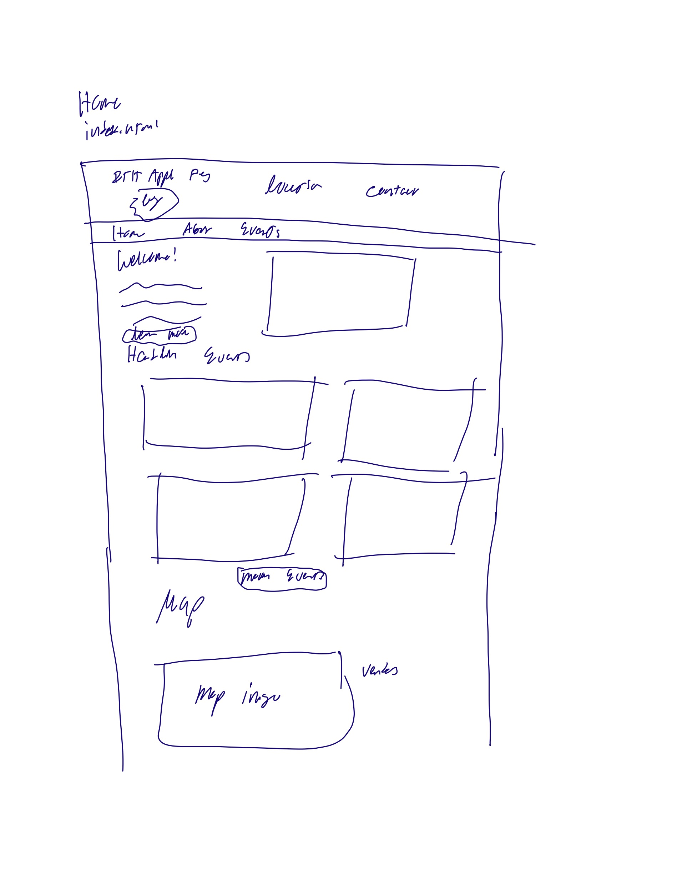 The home page for wide screens has most of the same content. The header has the logo, text, location, and contact info. The menu bar is under the header and the body contains images and text which tends to be side-by-side.
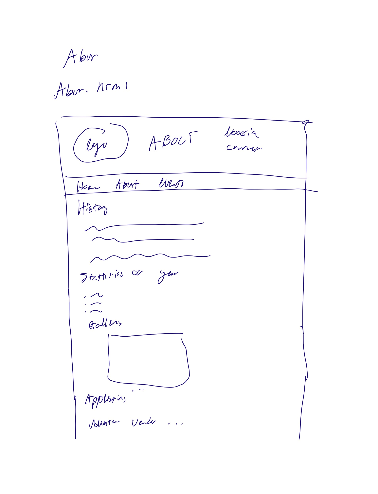 The about page is similar to the home page, with the same heading. This time, the content is one column top-down.
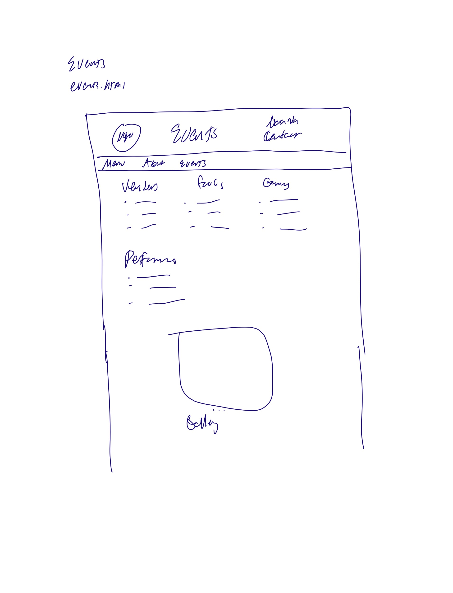The events page has the same heading and menu as before, there are three columns for the the types of vendors, and then the performances and gallery tab are left-justified top-down.

### Design Rationale (Milestone 1)
> Explain why your design is appropriate for your audience.
> Specially, why does your content organization, navigation, and site design/layout meet the goals of your users?
> How did you employ **design patterns** to improve the familiarity of the site for your audience?

The design of the website, as mentioned before, is optimal for the audience, who consists mainly of Ithaca resident, college students, particularly those interested in attending the festival. The content is organized into three pages. Primarily, users will visit the home page for quick reference, therefore, abbreviated content is placed here - such as highlight events, the map, and of course, the sponsors. Further information can be found in the other pages, events and about. About contains applications for vendors or volunteers, parking information, and more. The events page provides a full run down of what one can do and find at AppleFest. The page, when resized, will be responsive so that it is navigable on mobile and desktop. The wide version of the page will have a menu bar at the top and content will be top-down, with some content to the right such as images or the map. Largely, all content will left-justified. For the mobile version, content will be entirely top-down so there will be no horizontal scrolling. The menu will be hidden in a hamburger, and some content may be simplified for smaller screen. The design of the website will be simple and contain colors that allude to apples, upstate ny, and the fall. The sans-serif font will create a friendly page that is accessible and helpful for all users.

## User Testing (Final Submission)

### User Testing Tasks (Final Submission)
> Plan out your user testing tasks before doing your user testing.
> These must be actual user testing tasks.
> **Tasks are not questions!**

1. You and some friends want to go to Applefest this weekend. Given your busy schedules, it only seems like they are free Friday before 8 pm or Saturday morning before noon. Determine what a good time would be for your friends to go so you can be there for at least 2 hours.
2. Your aunt is away for the weekend and has asked you to take care of her dog. You want to go to Applefest, but don't know if bringing Fido is a good idea - determine whether or not if you should.
3. After much hemming and hawing, you're excited to go to Applefest Saturday morning. You hope to take the TCAT, but due to budget cuts and shortages (because of a certain uncooperative university) the route may not be reliable. You choose to carpool instead. Find a place where you can park your car.
4. One of your friends, out of sheer goodness of their heart (and a court order), decides to volunteer for the festival. Help them find where they can sign up.
5. Applefest on Saturday morning is rather busy! Your friends say their at the "live music stage." You only have your phone, but use the website to locate where your friends are.
6. Now that you're at the music stage, figure out who's going to perform there at noon.
7. Ouch! Rachel Beverly is so good that everyone started moshing and someone hurt their ankle! Find the best route to the EMT tent.
8. It's almost time to head home. But, the patient you delivered to the EMT tent has requested some "pain management." You spent all your money on overpriced apple cider donuts,  but you're willing to try your luck at a contest. You discover that the CBD store had a basket giveaway of a sampler. But, rapturous glee soon turns to miserly sorrows as your realize the giveaway occurred Thursday. The patient corrects themselves, they wanted *grain* management from Rashida Sawyer Bakery - apparently there's a discount on their goods. Find out what they are selling and what the discount is.

### Participant 1 (Final Submission)
> Using your notes from above, describe your user by answering the questions below.

1. Jenna, a senior in CS who has been to applefest before. They will work SWE at Amazon next year.

2. Does the user belong to your audience of the site?

    > If “No”, what’s your strategy of associating the user test results to your audience’s needs and wants? How can your re-design choices based on the user tests make a better fit for the audience?

Yes, they are a student at Cornell and visited Applefest this year. They would find the website helpful.

### Participant 1 -- Testing Notes (Final Submission)
> When conducting user testing, you should take notes during the test.

1. Sees the hours in first paragraph, and chooses Friday 3 pm.
2. Scrolls through the home page, and looks through the map to see if there’s any areas for dogs. In the FAQs, see’s that it’s a bad idea to bring a dog.
3. Goes to the map, and see’s there’s public parkin gon Green st and the parking garage
4. In the about page, scrolls through the page and sees the heading for volunteering. Clicking on the link they can help.
5. Goes to home a goes to where they know the map is. FInds the bernie melton stage easily.
6. Goes to the mpa, see the lineup, and finds rachel beverly.
7. Uses the map
8. Goes to the about page, and looks for a list of what’s there in the about section, says they’ll go to the map next. Sees the offering page, and easily finds them under food vendors. Assumes its under there, and that there is more detail toward the bottom. Finds the 25$ gift certificate that one can wind. Says alphabetized that it would be better.

Navigating the site was fine. Believes it would be better if the info was better listed intuitvely - if therw was a visual calendar for time, for example. Thinks the colunteering section should have its own tab (maybe join us), and the offering name is weird.

### Participant 2 (Final Submission)
> Using your notes from above, describe your user by answering the questions below.

1. Saniya, who is a sophmore ORIE major, and did not go to Applefest but had expressed interest. They do not have a job, they are full-time student.

2. Does the user belong to your audience of the site?

    > If “No”, what’s your strategy of associating the user test results to your audience’s needs and wants? How can your re-design choices based on the user tests make a better fit for the audience?

Yes, they are a student who would find this website useful for a future visit or to learn about the past applefest.

### Participant 2 -- Testing Notes (Final Submission)
> When conducting user testing, you should take notes during the test.

1. From the home page chooses to go Friday at noon
2. Looks through the home page. Goes to about and finds it in the FAQ - so probs won’t.
3. Easily finds garage and street parking on the about page, and names the Seneca and Cauyga garages.
4. Finds it in the page and easily locates the link
5. Looks through about and goes to the map on the main page. FInds it on the map.
6. Looking on the map, sees the lineup and determines rachel beverly!
7. Is able to find the way through the commons!
8. Navigates to offering scrolls down and notices the they offer apple items. 10%.

Was easy to navigate - nothing particularly unnatural.

### Participant 3 (Final Submission)
> Using your notes from above, describe your user by answering the questions below.

1. Who is your user, e.g., where does the user come from, what is the user's job, characteristics, etc.?

Zach, a sophomore Chem E Major. They do not have a job and visited Applefest with friends.

2. Does the user belong to your audience of the site?

    > If “No”, what’s your strategy of associating the user test results to your audience’s needs and wants? How can your re-design choices based on the user tests make a better fit for the audience?

Yes, they are student had used the website to help navigate.

### Participant 3 -- Testing Notes (Final Submission)
> When conducting user testing, you should take notes during the test.

1. 10-12 Saturday
2. Looks through the home page, doesn’t notice the menu bar, only looking at the body content. Finds the dog FAQ and say’s it strongly discouraged.
3. On the street or garage, from the appropriate section.
4. Wrongly states they can find it under applications
5. Returns to home and clicks on the map quickly. Finds the stage easily.
6. Returns to the website, goes to about, then offering, and sees its Rachel
7. Returns to the map and easily finds that one can go through the commons
8.  Goes through the map to locate Rashida bakery. Returns to offerings, and finds Rashida after some scrolling. Incorrectly stating they have a 25$ gift certificate.

No comment, layed out well.

### Potential Changes Based on User Testing (Final Submission)
> What changes would you make to your design based on user testing?
> Note: You are not required to change your design. Simply tell  us what you would change.

Overall, users were able to successfully complete all tasks with ease. Some interesting notes - the questions were easily answered if the user stayed on the map, whereas I had intended they be answered via content on the web page. Some users didn't see the menu bar at first. Some users did not answer the last question properly - they noted the gift basket, rather than the vendor listing. Users were able to navigate the site easily, and every test only took around 5 minutes to complete.

Suggested changes could possibly improving the menu bar so it is more noticeable. Moreover, removing duplicitous content, or placing it elsewhere. Having the map open in a new tab would be helpful. Only one user complained about the organization, they believed more pages would be helpful, but other users said they agreed with the org of the pages and didn't want it to be expanded. No complaints about theme or layout. No suggested changes for the mobile version.

## Rationale (Final Submission)

**This rationale should be polished writing:** one you might submit as a report to a client or boss to help explain the project and convince them you did a good job. You'll be surprised how much writing and communicating you need to do about projects and choices on internships and jobs; practice that here.

It should be a comprehensive, complete story of the project. You might find that each section runs about a paragraph. Sketches can often help tell the story of your design.

Your rationale should be a polished version of the earlier explanations.

### Audience (Final Submission)
> A complete and polished description of the intended audience(s) for your website.

Ithaca Downtown is hosting the 40th Apple Harvest Festival from 9/30 - 10/2! For many, this will be their third or fourth time, but, for others it may be their first time or they need a refresher. This website was designed with the audience of Ithacans in mind. Students and townies, as well as visitors, will require this website to help guide them through everything Applefest; whether in preparation, during, or afterwards, this website will help.

### Audience Goals
> Explain how your site's design addresses the goals of the audience.

This website intends to meet the many goals of different audience members. First and foremost, users wish to learn more about the festival in general. The website provides all basic information such as dates, times, and locations. It also provides vendors, performers, and a map to navigate. There is also a history of the festival, and info on getting to and fro and a FAQ. Audience members, whether if they are planning their day at Applefest, or already there, should find the site helpful in answer their questions and informing their schedule.

### Visual Design (Final Submission)
> An explanation of how the final design is appropriate for your audience.
> Include design patterns in your rationale.

First, the layout of the website is a simple 3-page design with a nav bar that sits at the left. When viewed on mobile devices, the nav bar may adapt by moving towards the top and across the screen. Every page is decorated with a header that reiterates Applefest and gives the name of the page. The home page includes the logo and dates, as well. All the content is left-justified and placed in paragraphs with an appropriate header. This allows for easy perusing and reading. Links are placed appropriately throughout.

The visual design is intended to be friendly and simple. The triadic color scheme evokes ideas of fall and apples, and the sans-serif font makes text easy to read and inviting. The use of images shows what users can expect for the festival, and adds decorative content that is also informative. The page is enhanced with its intentional theme to be friendly, informational, and useful for all users.

### Self-Reflection (Final Submission)
> Take some time here to reflect on how much you've learned since you started this class. It's often easy to ignore our own progress. Take a moment and think about your accomplishments in this class. Hopefully you'll recognize that you've accomplished a lot and that you should be very proud of those accomplishments!

This project was a bit different to project 1 because all the content was provided, and we focused on creating a website with responsive design. We learned more about CSS and how to better work (wrestle) with flexboxes. We also learned about user interviews and user testing, which are crucials elements in web design.

I enjoyed this project to an extent, though found working with media queries and the nav bar frustrating. Copy and pasting content felt tedious, but was necessary. I feel more confident in working with CSS and web design overall.

## Grading (Final Submission)

### Collaborators
> List any persons you collaborated with on this project.

None.

### Reference Resources
> Please cite any external resources you referenced in the creation of your project.
> (i.e. W3Schools, StackOverflow, Mozilla, etc.)

1. Mozilla Reference Documentation
2. Stack Overflow
3. Course labs
